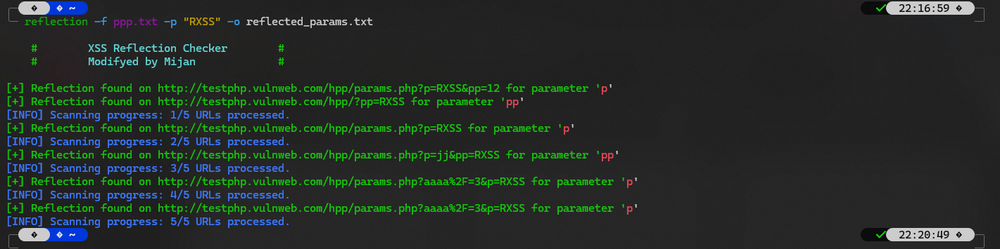

## Usage

```
reflection -f all_urls.txt -p "RXSS" -o reflected_params.txt
```



## Options

```
reflection -h

    #        XSS Reflection Checker        #
    #        Developed by Mijan             #

usage: reflection [-h] -f FILE [--threads THREADS] [-o OUTPUT] [-p PLACEHOLDER]

Reflection Checker

options:
  -h, --help            show this help message and exit
  -f FILE, --file FILE  Path to the text file containing URLs
  --threads THREADS     Number of threads to use (default: 5)
  -o OUTPUT, --output OUTPUT
                        Output file for saving results (default: xss.txt)
  -p PLACEHOLDER, --placeholder PLACEHOLDER
                        Placeholder text to use for reflection testing (default: RXSS)
```

## installation

```
cd /opt/ && sudo git clone https://github.com/h6nt3r/reflection.git
cd
sudo chmod +x /opt/reflection/*.py
sudo ln -sf /opt/reflection/reflector.py /usr/local/bin/reflection
sudo apt install dos2unix -y
sudo dos2unix /opt/reflection/reflector.py
reflection -h
```

## additional installations

```
pip install charset-normalizer
```
